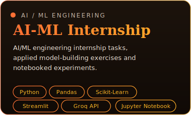
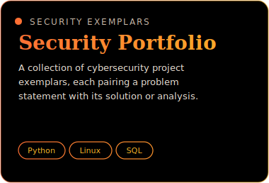
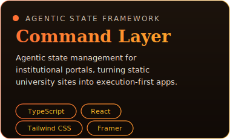
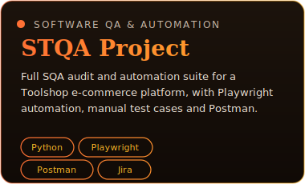

  

 

 

<table width="100%">
<tr>
<td width="50%" valign="top">

**Location:** Layyah, Punjab, Pakistan  
**Education:** BS Information Technology, University of Layyah  
**Academic Standing:** CGPA 3.93 / 4.00 · 84% Aggregate  
**Recognition:** Competitor, SOFTEC'26 Software Project Competition  
**Membership:** AWS Student Builder Groups

</td>
<td width="40%" valign="top">

Innovative IT undergraduate specializing in intelligent, secure software systems, spanning reinforcement-learning agents, full-stack platforms, and zero-trust security architecture.

</td>
</tr>
</table>

 

 

<table width="100%">
<tr>
<th align="left" width="25%">Domain</th>
<th align="left">Stack</th>
</tr>
<tr>
<td valign="top"><strong>AI &amp; Data Engineering</strong></td>
<td>Reinforcement Learning (Q-Learning) · Bellman Equation · NumPy · Pandas · Scikit-Learn</td>
</tr>
<tr>
<td valign="top"><strong>Software &amp; Web Engineering</strong></td>
<td>Python · JavaScript (ES6+) · TypeScript · C++ · Node.js · Express.js · HTML5 / CSS3</td>
</tr>
<tr>
<td valign="top"><strong>Cybersecurity &amp; Mobile</strong></td>
<td>Identity Authentication · Network Security · Linux · React Native · Clerk Auth · MongoDB · SQLite3</td>
</tr>
</table>

 

 

 

<table width="100%">
<tr>
<th align="left" width="20%">Project</th>
<th align="left" width="45%">Summary</th>
<th align="left">Stack</th>
</tr>
<tr>
<td valign="top"><strong>INCEPT</strong> Full Stack Utility Platform</td>
<td valign="top">Integrates custom AI object detection with voice-to-transcript workflows across a unified full stack interface.</td>
<td valign="top">Node.js · Express.js · MongoDB · JavaScript · AI Inference APIs</td>
</tr>
<tr>
<td valign="top"><strong>WONTX AI</strong> Behavioral Biometric Authentication</td>
<td valign="top">Autonomous desktop tool using a Q-Learning agent to track real-time input rhythm (mouse velocity, jitter, key dwell/flight time), locking the workstation on intruder detection.</td>
<td valign="top">Python · Pynput · NumPy · Pandas · CustomTkinter</td>
</tr>
<tr>
<td valign="top"><strong>TunePrompt</strong> Cross-Platform AI Prompt Engineering</td>
<td valign="top">Mobile app translating simple concepts into high-fidelity AI prompts for video editors and SEO experts, reducing LLM hallucination.</td>
<td valign="top">React Native (Expo) · TypeScript · Expo Router · Clerk Auth · Groq API (Llama-3)</td>
</tr>
</table>

 

<strong>MORE PROJECTS</strong>

   

 

 

<table width="100%">
<tr>
<th align="left" width="60%">Credential</th>
<th align="left">Issuer</th>
</tr>
<tr><td>Google Cybersecurity Professional Certificate</td><td>Google / Coursera</td></tr>
<tr><td>Foundations of Cybersecurity</td><td>Google / Coursera</td></tr>
<tr><td>Play It Safe: Manage Security Risks</td><td>Google / Coursera</td></tr>
<tr><td>Connect &amp; Protect: Networks &amp; Network Security</td><td>Google / Coursera</td></tr>
<tr><td>Tools of the Trade: Linux &amp; SQL</td><td>Google / Coursera</td></tr>
<tr><td>Assets, Threats &amp; Vulnerabilities</td><td>Google / Coursera</td></tr>
<tr><td>Automate Cybersecurity Tasks with Python</td><td>Google / Coursera</td></tr>
<tr><td>Sound the Alarm: Detection and Response</td><td>Google / Coursera</td></tr>
<tr><td>Put It to Work: Prepare for Cybersecurity Jobs</td><td>Google / Coursera</td></tr>
<tr><td>Cybersecurity Job Simulation</td><td>Mastercard</td></tr>
<tr><td>Advanced Commands in Linux</td><td>Coursera</td></tr>
<tr><td>Files &amp; Directories in Linux Filesystem</td><td>Coursera</td></tr>
<tr><td>AI Fundamentals</td><td>Coursera</td></tr>
<tr><td>14-Day AI Bootcamp</td><td>Futurepedia</td></tr>
<tr><td>Accelerate Your Job Search with AI</td><td>Coursera</td></tr>
<tr><td>SEO Certificate</td><td>DigiSkills.pk, Ministry of IT</td></tr>
<tr><td>Freelancing Certificate</td><td>DigiSkills.pk, Ministry of IT</td></tr>
<tr><td>SOFTEC'26 Software Project Competition</td><td>SOFTEC</td></tr>
</table>

 

 

 

<table>
<tr>
<td align="center" style="border: 1px solid rgba(255,107,53,0.4); border-radius: 10px; padding: 10px 18px;">
 &nbsp; Google Cybersecurity Certificate
</td>
<td align="center" style="border: 1px solid rgba(255,107,53,0.4); border-radius: 10px; padding: 10px 18px;">
 &nbsp; Softec'26 Competitor
</td>
<td align="center" style="border: 1px solid rgba(255,107,53,0.4); border-radius: 10px; padding: 10px 18px;">
 &nbsp; 240+ Contributions
</td>
</tr>
</table>

  

<table>
<tr>
<td style="border: 1px solid rgba(255,107,53,0.35); border-radius: 12px; padding: 6px;"></td>
<td style="border: 1px solid rgba(255,107,53,0.35); border-radius: 12px; padding: 6px;"></td>
</tr>
</table>

  

  

 

<table>
<tr>
<td align="center" style="border: 1px solid rgba(255,107,53,0.4); border-radius: 12px; padding: 12px 20px;"></td>
<td align="center" style="border: 1px solid rgba(255,107,53,0.4); border-radius: 12px; padding: 12px 20px;"></td>
<td align="center" style="border: 1px solid rgba(255,107,53,0.4); border-radius: 12px; padding: 12px 20px;"></td>
</tr>
</table>

  

